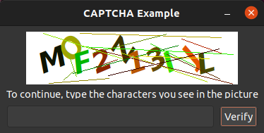
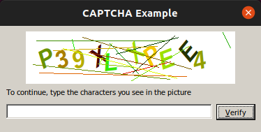

# Lazarus CAPTCHA

Captcha Verification (or Completely Automated Public Turing Test to tell Computers and Humans Apart) is a common web technique used to help ensure that your respondents are real humans and not a program written to spam your survey.

This is a Lazarus implementation that you can use in your own projects.

It's a fork from the Delphi version here: [Captcha Verification](https://github.com/JensBorrisholt/Captcha-Verification) by [Jens Borrisholt](https://github.com/JensBorrisholt).

## Screenshots

**Linux**

**Wine**

Sorry I don't have a windows machine to take a screenshot from.

### Todo

- [ ] Need to get that background to be white.
