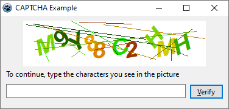

# Lazarus CAPTCHA

Captcha Verification (or Completely Automated Public Turing Test to tell Computers and Humans Apart) is a common web technique used to help ensure that your respondents are real humans and not a program written to spam your survey.

This is a Lazarus implementation that you can use in your own projects.

It's a fork from the Delphi version here: [Captcha Verification](https://github.com/JensBorrisholt/Captcha-Verification) by [Jens Borrisholt](https://github.com/JensBorrisholt).

## Screenshots

**Linux**

**Wine**

**Windows**

### Todo

- [x] ~~Need to get that background to be white~~.
- [ ] Need to find out why optimization greater than 1 messes up the font size and rotation in Linux.
- [ ] Need to make this into a Visual component like the one [WP](https://github.com/wp-xyz) made: [captcha_component](https://github.com/wp-xyz/captcha_component)